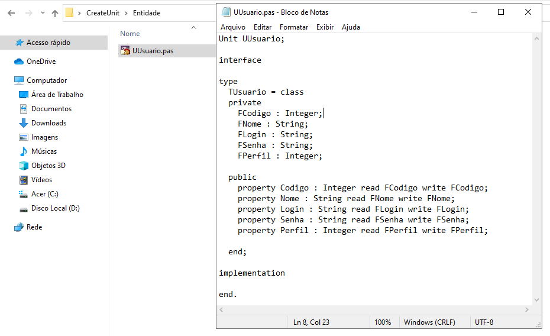

# CreateUnit

Criação de arquivos .pas através do comando "CREATE TABLE" do MYSQL.
Inclui os atributos, propriedades de leitura e escrita.

Figura 01: Tela inicial.

Figura 02: Executando.

Figura 03: Resultado.

No mesmo diretório do executavel é criado a subpasta "..\Entidade\" onde será armazenado todos os arquivos criado pelo programa.

